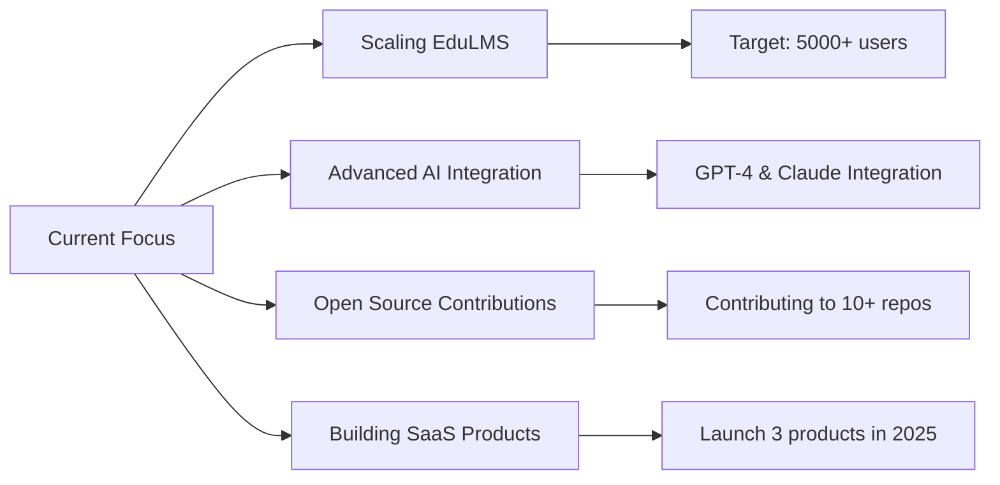

<div align="center">


<p align="center">
  <a href="https://mfaseeh.tech"></a>
  <a href="[https://linkedin.com/in/mfaseeh](https://www.linkedin.com/in/mfaseeh115/)"></a>
  <a href="https://github.com/FaseehRizwan"></a>
  <a href="mailto:contact@mfaseeh.tech"></a>
  <a href="https://wa.me/923001234567"></a>
</p>

<p align="center">
  
  
  
</p>


</div>

---

## 💫 About Me


<div align="left">

👨‍💻 **Full-Stack Developer** passionate about building impactful solutions  
🚀 **Founder & CEO** of EduLMS - Serving 500+ students  
🎓 **BS Computer Science** Student (2022-2026)  
🌍 **Based in** Pakistan 🇵🇰  
🤖 **Specialized in** AI Automation & Web/Mobile Development  

### 🎯 Current Focus
- 🔨 Scaling EduLMS to 5000+ users
- 🧠 Building AI-powered automation tools
- 🌱 Contributing to open-source projects
- 💼 Open to Full-Time & Freelance opportunities

### 💡 Philosophy
> **"Execution > Syntax | Ship Products, Not Promises"**  
> I don't just write code — I build solutions that solve real problems

</div>

<br clear="both"/>

---

## 🎯 What I Bring to the Table

<table>
<tr>
<td width="50%">

### 💼 Professional Experience
- ✅ **Founder & CEO** of EduLMS - Learning Management Platform
- ✅ Built **AI-powered automation systems** serving real users
- ✅ Developed **WhatsApp Business Bots** for client automation
- ✅ Created **full-stack web & mobile applications** from scratch
- ✅ Experience with **production-grade deployments** and scaling

</td>
<td width="50%">

### 🔥 Core Competencies
- ⚡ **Full-Stack Development** (Frontend + Backend + Database)
- 🤖 **AI & Automation** (Bots, Workflows, Smart Systems)
- 📱 **Mobile Development** (Flutter, Cross-platform)
- 🎨 **UI/UX Design** (Figma, User-centered design)
- ☁️ **Cloud & DevOps** (Deployment, CI/CD, Server Management)

</td>
</tr>
</table>

---

## 🛠️ Technical Arsenal

### 💻 Languages
<p align="left">
  
  
  
  
  
  
  
</p>

### 🚀 Frameworks & Libraries
<p align="left">
  
  
  
  
  
  
  
  
</p>

### 🗄️ Databases & Cloud
<p align="left">
  
  
  
  
  
</p>

### 🤖 AI & Automation
<p align="left">
  
  
  
  
  
</p>

### 🛠️ Tools & Platforms
<p align="left">
  
  
  
  
  
  
  
  
</p>

---

## 🏆 Featured Projects

<table>
<tr>
<td width="50%">

### 🎓 EduLMS - Learning Management System
**A comprehensive platform revolutionizing online education**

🔹 **Tech Stack:** Node.js, Express, MongoDB, Flutter, React  
🔹 **Features:**
- Student & instructor management
- Interactive course delivery system
- Real-time progress tracking
- Payment gateway integration
- Mobile & web responsive

🔗 **[Live Demo](https://mfaseeh.tech)** | 📊 Impact: Serving 500+ students

</td>
<td width="50%">

### 🤖 AI Automation Suite
**Intelligent automation tools for business workflows**

🔹 **Tech Stack:** Node.js, Python, OpenAI API, Puppeteer  
🔹 **Features:**
- Custom AI chatbots with learning capability
- Document processing automation
- Data extraction & analysis
- Workflow optimization tools

🔗 **[GitHub Repo](https://github.com/mfaseeh/ai-automation)** | ⭐ 50+ Stars

</td>
</tr>

<tr>
<td width="50%">

### 💬 WhatsApp Business Automation
**Smart bots automating customer interactions**

🔹 **Tech Stack:** Node.js, WhatsApp Web API, MongoDB  
🔹 **Features:**
- Automated customer responses
- Order management system
- Appointment scheduling
- Multi-agent support

🔗 **[GitHub Repo](https://github.com/mfaseeh/whatsapp-bots)** | 💼 Used by 10+ businesses

</td>
<td width="50%">

### 🌐 Portfolio & More
**Additional projects showcasing diverse skills**

🔹 **E-commerce Solutions** - Full-stack shopping platforms  
🔹 **Dashboard Analytics** - Real-time data visualization  
🔹 **API Development** - RESTful services & microservices  
🔹 **Chrome Extensions** - Productivity tools  

🔗 **[View All Projects](https://mfaseeh.tech/projects)**

</td>
</tr>
</table>

---

## 📊 GitHub Analytics

<p align="center">
  
  
</p>

<p align="center">
  
</p>

<p align="center">
  
</p>

<div align="center">
  
</div>

---

## 💼 Professional Skills Matrix

<table>
<tr>
<td width="33%">
  
### 🎨 Frontend Development
```javascript
React.js         ████████████ 90%
Flutter          ███████████░ 85%
Next.js          ██████████░░ 80%
Vue.js           █████████░░░ 75%
UI/UX Design     ████████████ 90%
Responsive       ████████████ 95%
```

</td>
<td width="33%">

### ⚙️ Backend Development
```javascript
Node.js          ████████████ 92%
Express.js       ████████████ 90%
REST APIs        ███████████░ 88%
MongoDB          ██████████░░ 85%
PostgreSQL       █████████░░░ 80%
Authentication   ████████████ 90%
```

</td>
<td width="33%">

### 🤖 AI & Automation
```javascript
ChatGPT API      ███████████░ 87%
Bot Development  ████████████ 90%
Workflow Auto    ████████████ 91%
Web Scraping     ██████████░░ 85%
Python Scripts   █████████░░░ 78%
Process Auto     ████████████ 89%
```

</td>
</tr>
</table>

---

## 🎓 Education & Certifications

<table>
<tr>
<td width="50%">

### 🎓 Formal Education
- **Bachelor of Science in Computer Science**  
  *Currently Pursuing | 2022 - 2026*  
  Focus: Software Engineering, AI, Data Structures

</td>
<td width="50%">

### 📜 Certifications & Learning
- ✅ Full-Stack Web Development
- ✅ AI & Machine Learning Fundamentals
- ✅ Flutter Mobile Development
- ✅ Cloud Computing Basics
- ✅ Advanced JavaScript & Node.js

</td>
</tr>
</table>

---

## 🌟 Why Work With Me?

<div align="center">

| 💡 Problem Solver | 🚀 Fast Executor | 📚 Quick Learner | 🤝 Team Player |
|:-----------------:|:----------------:|:----------------:|:--------------:|
| I don't just code, I solve real business problems with technology | Ship quality products quickly without sacrificing standards | Rapidly adapt to new technologies and frameworks | Excellent communication and collaboration skills |

</div>

---

## 📈 Current Focus & Goals



---

## 🤝 Let's Connect & Collaborate

<div align="center">

### 💬 I'm Available For:

<table>
<tr>
<td align="center">🏢<br/><b>Full-Time Roles</b><br/>Software Engineer, Full-Stack Developer</td>
<td align="center">💼<br/><b>Freelance Projects</b><br/>Web & Mobile App Development</td>
<td align="center">🤖<br/><b>AI Automation</b><br/>Custom Bots & Workflow Solutions</td>
<td align="center">🎯<br/><b>Consulting</b><br/>Technical Architecture & Strategy</td>
</tr>
</table>

### 📫 How to Reach Me

<p align="center">
  <a href="mailto:contact@mfaseeh.tech">
    
  </a>
  <a href="https://mfaseeh.tech">
    
  </a>
  <a href="https://linkedin.com/in/mfaseeh">
    
  </a>
  <a href="https://github.com/mfaseeh">
    
  </a>
</p>

### ⚡ Fun Fact
> I started coding to automate my homework... now I'm automating entire businesses! 🚀


</div>

---

<div align="center">

### 💭 My Philosophy

> **"The best way to predict the future is to build it."**  
> *I don't wait for opportunities — I create them through code.*

### 🎯 2025 Goals Tracker

  
  
  


---

**⭐ If you find my work valuable, consider starring my repositories!**


</div>
